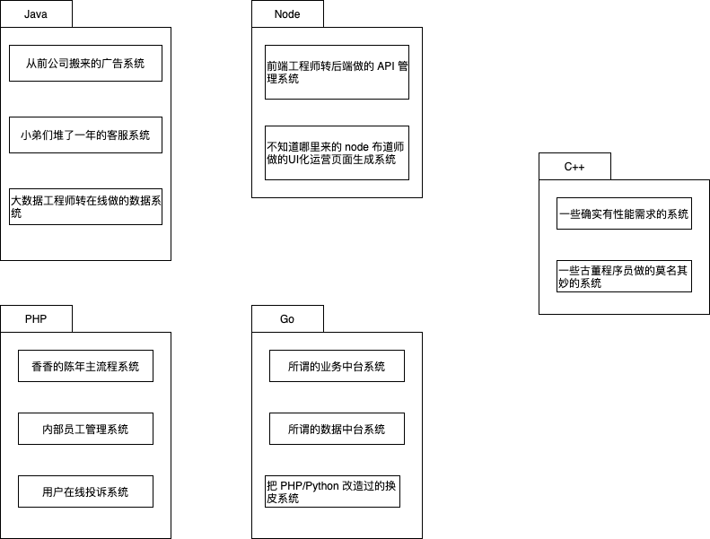
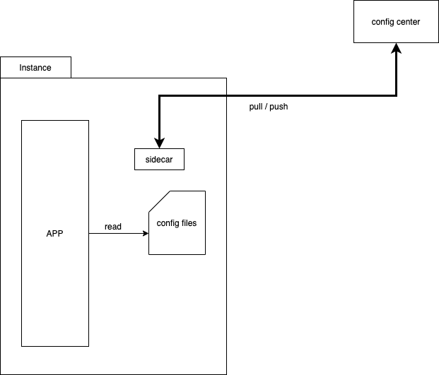

= service mesh 乱谈

== 为什么需要 sidecar

稍微大一点的公司，不管架构图画的多好看，内部可能都是下面这样的现状：

如果想在公司内新做一套配置推送系统，本来只需要做一遍的 sdk 工作就会需要乘以语言数量：

image::why_sm-clientspng.png[]

程序员也不傻，总还是有解决办法的：

image::sidecar.png[]

出自 《Designing Distributed Systems》。

image::sidecar2.jpeg[]

狗坐的位置就是 sidecar(笑

总之，我们把自己的工作的大头集中在了 sidecar 里，SDK 的工作虽没有完全省掉，但已被极大简化，只剩下比如：

* 读取文件，替换内存中的 map
* 向本地的 sidecar 发一个 http 请求。

是在一个面试的时间内就能完成的代码。

== 为什么需要 mesh

image::ratelimit.png[]

image::circuitbreaker.png[]

image::lb.png[]

嗯，你说为什么呢？

[quote, https://jimmysong.io/blog/what-is-a-service-mesh/]
____
服务网格（Service Mesh）是处理服务间通信的基础设施层。它负责构成现代云原生应用程序的复杂服务拓扑来可靠地交付请求。在实践中，Service Mesh 通常以轻量级网络代理阵列的形式实现，这些代理与应用程序代码部署在一起，对应用程序来说无需感知代理的存在。
____

