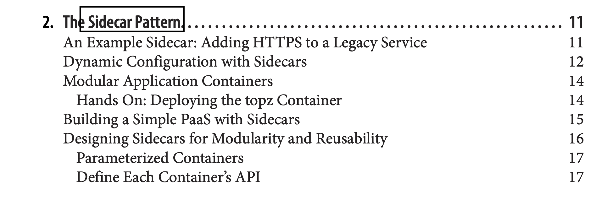
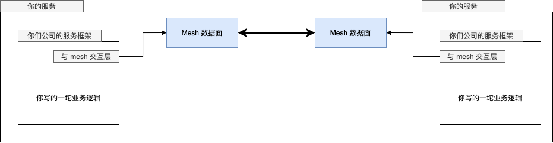
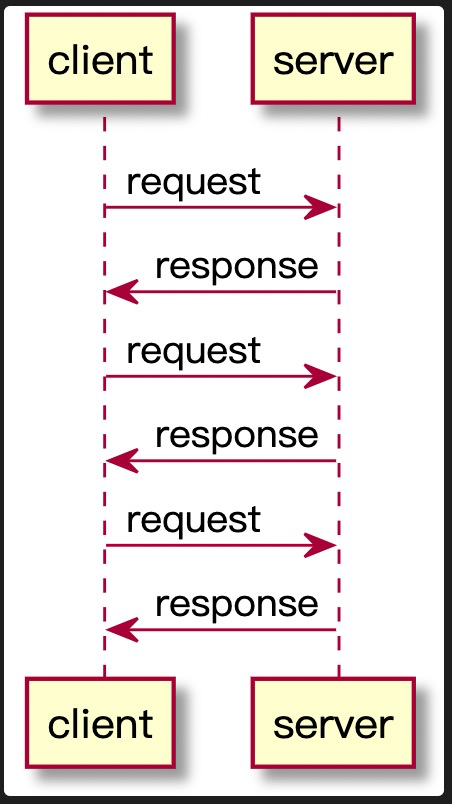
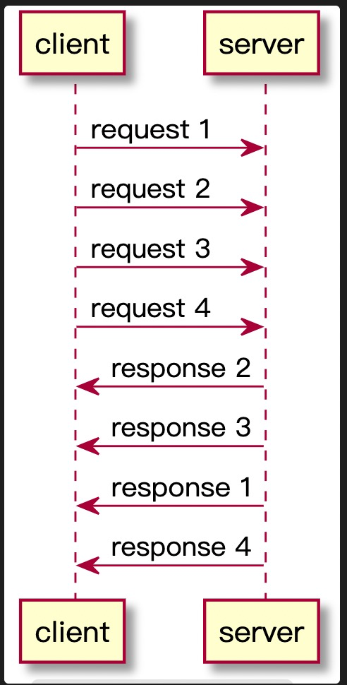
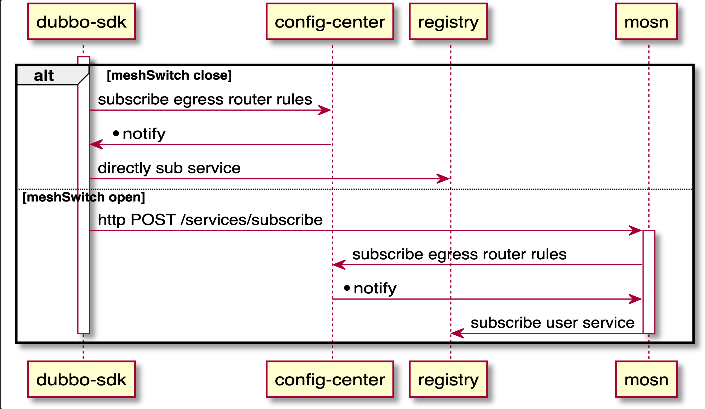

:toc:
= service mesh 乱谈

== 为什么需要 sidecar

稍微大一点的公司，不管架构图画的多好看，内部可能都是下面这样的现状：

image::why_sm.png[大公司的系统现状]

如果想在公司内新做一套配置推送系统，本来只需要做一遍的 sdk 工作就会需要乘以语言数量：

image::why_sm-clientspng.png[]

程序员也不傻，总还是有解决办法的：

出自 《Designing Distributed Systems》。

image::sidecar2.jpeg[]

狗坐的位置就是 sidecar(笑

image::sidecar3.png[]

总之，我们把自己的工作的大头集中在了 sidecar 里，SDK 的工作虽没有完全省掉，但已被极大简化，只剩下比如：

* 读取文件，替换内存中的 map
* 向本地的 sidecar 发一个 http 请求。

是在一个面试的时间内就能完成的代码。热更新相关的知识：

* 无锁双 buffer
* fsnotify

== 为什么需要 mesh

image::ratelimit.png[]

image::circuitbreaker.png[]

image::lb.png[]

嗯，你说为什么呢？

[quote, https://jimmysong.io/blog/what-is-a-service-mesh/]
____
服务网格（Service Mesh）是处理服务间通信的基础设施层。它负责构成现代云原生应用程序的复杂服务拓扑来可靠地交付请求。在实践中，Service Mesh 通常以轻量级网络代理阵列的形式实现，这些代理与应用程序代码部署在一起，对应用程序来说无需感知代理的存在。
____

image::sdk_and_sm-Page-1.png[]

有了 mesh 以后，变成了这样：

功能没有消失，只是从 sdk 搬家到了独立的外部进程。

从工程角度来讲，下沉的好处：

* 语言相关的轮子变成了语言无关的公共轮
* 业务团队忙业务，基础社区团队忙基础设施，模块解耦，分工细化
* 不用求你的客户来升级了，自己就能搞定。爸爸变回了同事。

== service mesh 的基本概念

=== 数据面

本质上就是请求转发代理，只不过集成了传统的限流、熔断、Tracing、加密等等稳定性(你开心的话你叫服务治理也可以)或安全相关的功能。

=== 控制面

控制的对象就数据面，负责管理数据面的配置。目前社区中的事实标准是 istio，但 istio 很折腾，升级架构大变化。最近还有说不清的商标捐献骚操作。开源社区的政治问题也不少。

== mesh 的麻烦

=== 协议太多

就像 RPC 框架万年统一不了一样，一个公共的流量层就需要去对接五花八门的协议：

* HTTP
* HTTP/2
* HTTP/3
* dubbo
* sofarpc
* gRPC
* thrift

如果一个公司内存在多种 RPC 协议，可能会比较痛苦。但我们可以给我们认识的协议简单分个类。根据协议的交互方式，可以分为 pingpong，和 multiplex 两种类型。

====  pingpong

请求发送完毕后，需要阻塞等待响应。一个请求的响应处理完才能发送下一个请求。典型的比如：

* HTTP
* redis 协议
* MySQL 协议

这种模型比较简单，实现客户端也简单：

encode payload -> write data to connection -> read block until data ready -> decode

====  multiplex

向连接发送请求完毕后，不用等待响应就可以继续发送请求。

对于客户端来说，比以前复杂了，请求和响应处理不是顺序流程，所以一般会有一个 map 来记录请求和响应的关系：

[source,c]
----
type http2ClientConn struct {
	....
	streams         map[uint32]*http2clientStream // 就是这里
	nextStreamID    uint32
	....
}
----

响应解析完毕后，用 stream id 去 map 里找到对应的 request 并唤醒相应的 client。

这种响应模型在 Go 里还是比较容易想到怎么做的，我们只要在 stream 对象里放一个 channel 就行了：

[source,c]
----
type http2clientStream struct {
	....
	resc          chan http2resAndError // 就是这里
	....
}
----

其它类型的 RPC 协议和 http1，http2 其实没什么本质区别。

除了交互方式有差不多，具体的协议设计其实都差不了多少。

image::packet.gif[]

=== 需要业务改造

服务发现需要按照社区标准进行改造。比较典型的，dubbo 的服务发现设计和 istio 的就对不上。

如果你们公司有相对统一的服务框架，哪怕每门语言是用统一的框架都行。

当然，一个语言五种框架的公司也不是没有。碰上这样的场景，可能还是需要改很多 sdk。

=== 不可忽视的性能问题

A -> B 变成了 A-> mesh -> mesh -> B

即使是高性能语言编写的模块，网络多了两跳也是开销。

如果单机 QPS 上万，性能问题就更为严重。

=== 编程语言实在太多了

如果你们公司主语言是 Java，使用 HTTP 通信。引入了 istio 做控制面，envoy 做数据面。那么整个架构中就有了三种语言。运维的灾难。

=== 二开难

如果想要对目前社区的主流 service mesh 方案进行二次开发，那么还是比较难的。你需要懂 Go，需要懂 C++。你还得懂 Google(笑

== mosn 这样的 mesh 项目是怎么落地的

项目一出生就上 istio 的贼船的话，那你这辈子都上不了线了。

比较聪明的做法，在一个模块里把控制面和数据面的工作都先集成了。让公司原有的服务发现能平滑融入到新的 mesh 模块中：

== mesh 的未来

=== proxyless

image::proxyless.jpg[]

=== 巨无霸 mesh

image::sdk_and_sm-Page-3.png[]

== continuous profiling

:google_paper: https://research.google/pubs/pub36575/

Google 2010 的老论文：{google_paper}，和一篇更说人话的文章，https://www.opsian.com/blog/what-is-continuous-profiling/，对 continuous profiling 进行了说明。

Google 把这种 continuous profiling 包装成产品在 Google Cloud 上卖钱，不过还是好心地给出了文章：https://medium.com/google-cloud/continuous-profiling-of-go-programs-96d4416af77b，还有 client 端的代码： https://github.com/googleapis/google-cloud-go/tree/master/profiler

image::stackimpact.png[]

continuous profiling 能给我们带来的益处：

=== 快速定位性能恶化问题

模块上线过程中，从 metrics 里发现突然炸了。这时候通常的做法是回滚，在预发环境研究为什么新版本上线导致爆炸。

这个过程是很浪费时间的，并且导致问题的原因又不一定复现得出来(比如因为你和线上机器的负载不一样，环境有细微差别)。

定位不出来你就没法上线，不上线问题又复现不了，尴尬不尴尬。

在线上系统进行实时问题定位同样麻烦，即使你能拿到当前出问题的 profile，没有历史的 profile 做对比，你看不出来异常情况和正常情况有什么差别，因为通过一个 profile 文件，你不知道某个 dag 图上的节点到底是正常的还是异常的。(即使用 pprof 的 --base 来做 diff，其实也还是挺麻烦的，公司的线上实例想 dump 要各种权限审批。)

=== 节省服务器成本

能够对应用进行持续的 profiling，那你其实可以进行非常细粒度的优化。每次上线都可以进行对比，并在有结论后马上进行优化。

如果开发者工资比较高(笑，让他花时间来做这些劳动密集的性能测试还不如直接在基础设施中提供能够持续 profiling 的功能。

持续、方便地对系统进行优化，能第一时间发现瓶颈，并及时优化。

=== 改进开发者的工作流程

开发者往往会在线下开发过程中，对自己的程序性能进行一些假设。而实际的生产环境和开发者的假设基本上是对不上的。举个例子，很多开发者在网上看了几篇逃逸分析的文章，就觉得到处都是逃逸，影响了自己模块的性能。并花费很大精力在这些莫名其妙的优化上。结果上线以后发现性能提升 0%。

continuous profiling 不需要你做任何假设。

这种及时反馈的做法，对于提升开发者的体验帮助还是比较大的，现在的前端工程师们，在写 js 的时候，效果基本上都是可以实时看到的。后端工程师能够及时获取到系统的性能表现的话，自然也能够更及时地做更多事情：

image::cp.png[]

== 开源社区的政治问题

不管怎么洗，商业公司主导的开源项目，背后都是有商业目的的。

=== 巨头公司的话语霸权

* 所有互联网公司都是业务驱动
* 基础设施建设相比业务研发投入是数量级的差别
* 巨头的 1% 投入，对于普通的公司来说可能就是 100%，本质上是规模效应的碾压
* 社区内有很强的技术崇拜

=== 伪开源

* 核心模块和代码由主导公司内的人投入
* 外人只能负责在外围做“生态建设”
* 核心模块的贡献可能因为 "very specific"，而被拒绝

=== 非功利?

* 项目负责人晋升项目死了？
* 很多 committer 拿到了认证之后就刷新一下简历跳槽了

=== 积极地看

* 可以给你心仪公司的项目多做贡献，说不定就可以加入哦
* 用不用是一回事，学不学是另一回事
* 要多思考，不要变成传话喇叭

== 一波宣传

mosn 项目地址：

github.com/mosn/mosn

