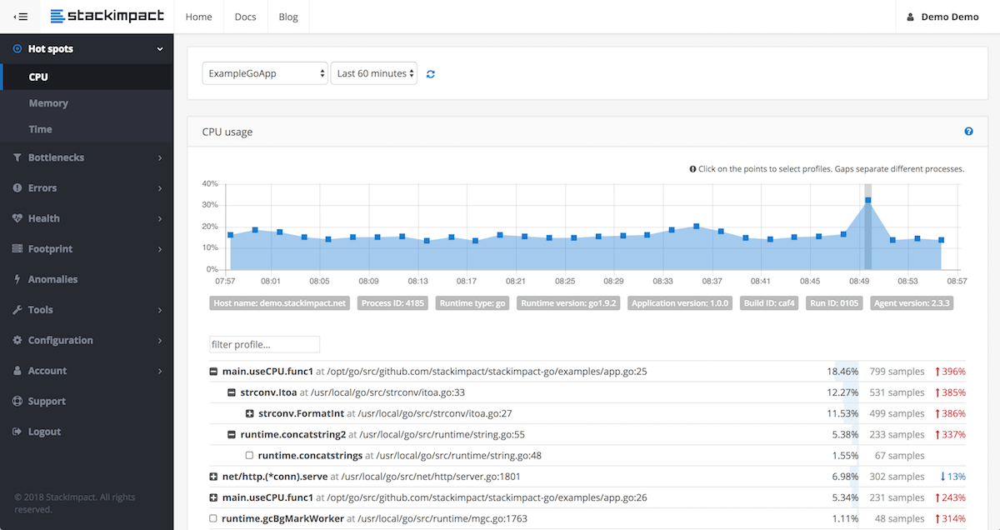

=  Go 语言性能优化

https://colin-scott.github.io/personal_website/research/interactive_latency.html[Latency numbers every programmer should know
]

== 优化工作流

建立评估指标(eg. Latency) -> 定位瓶颈(一般都会定位到某个局部) -> 寻找局部解决问题方案 -> 尝试方案

不断重复

== 问题定位工具

=== pprof

基本原理：

[quote]
____
The builtin Go CPU profiler uses the setitimer(2) system call to ask the operating system to be sent a SIGPROF signal 100 times a second. Each signal stops the Go process and gets delivered to a random thread's sigtrampgo() function. This function then proceeds to call sigprof() or sigprofNonGo() to record the thread's current stack.

Since Go uses non-blocking I/O, Goroutines that wait on I/O are parked and not running on any threads. Therefore they end up being largely invisible to Go's builtin CPU profiler.
____

每秒被唤醒 100 次，记录每个线程上的栈，那些等待 IO 被 gopark 之类挂起的 goroutine 不会被采集到，因为不在线程上运行，gopark 挂起 goroutine 后，当前线程一般会进 schedule -> findrunnable 的调度循环。

=== fgprof

[quote]
____
fgprof is implemented as a background goroutine that wakes up 99 times per second and calls runtime.GoroutineProfile. This returns a list of all goroutines regardless of their current On/Off CPU scheduling status and their call stacks.
____

比较类似，但是会包含那些 Off CPU 的 goroutine。

可以用来诊断 CPU、IO 混合的执行时间占比。

这个成本还是比普通的 pprof 高一些的。

=== trace

一般用来诊断一些诡异的抖动问题，或 runtime 的 bug(或者用来学习 runtime 的执行流)，用来做问题诊断效果一般。

基本原理是在 runtime 中埋了大量点，记录一堆 event 来追踪 runtime 执行流程。

如果对一些调度问题有疑问，可以在 trace 里做观察，不过拿来定位问题还是比较费劲的。

https://xargin.com/a-rlock-story/

=== perf

perf 也是可以用的，比如线上没开 pprof 的时候，发现 CPU 炸了，perf 可以看看到底在干啥，因为 Go 默认会把 DWARF 调试信息带进二进制文件中，通过 perf 的 zoom 功能也可以一直看到哪行代码(或者是汇编)占用了比较高的 CPU。

[source, text]
----
$ perf stat -e task-clock,cycles,instructions,cache-references,cache-misses ./hello
yyyy

 Performance counter stats for './hello':

          1.464376      task-clock (msec)         #    0.979 CPUs utilized
         3,681,288      cycles                    #    2.514 GHz
         1,722,170      instructions              #    0.47  insn per cycle
            46,475      cache-references          #   31.737 M/sec
            21,479      cache-misses              #   46.216 % of all cache refs

       0.001495925 seconds time elapsed
----

perf top

image::perf.png[]

== 局部优化

go test -bench=. -benchmem

或者

go test -cpuprofile -bench

memprofile 同理，一次只 bench 一种，否则可能不准。

== 全局优化

寻找程序的整体瓶颈。

wrk、pprof、压测平台

https://github.com/bojand/ghz

有压测平台是最好的，方便 AB，自己玩比较容易手忙脚乱，数据错位(压测的时候收集数据写报告经常容易张冠李戴，导致返工，还是有平台安逸)。

== 性能瓶颈举例

=== 业务逻辑

[WARNING]
====
调用外部命令
====

[source,go]
----
package main

import (
	"os/exec"
	"testing"

	uuid "github.com/satori/go.uuid"
)

var uu []byte
var u1 uuid.UUID

func BenchmarkUUIDExec(b *testing.B) {
	for i := 0; i < b.N; i++ {
		uu, _ = exec.Command("uuidgen").Output()
	}
}

func BenchmarkUUIDLib(b *testing.B) {
	for i := 0; i < b.N; i++ {
		u1 = uuid.NewV4()
	}
}
----

=== 序列化 CPU 占用过高

寻找一些针对性进行过优化的库，或者从文本协议更换为二进制协议。

比如 k8s 为了性能就集成了 jsoniter。

=== 算法时间复杂度

显而易见，O(logn) 和 O(n)，O(logn) 最多就 64 次，而 O(n) 可能耗尽计算资源。

runtime 里的算法优化：

[ditaa,file="runtime_opt.png"]
----
                     ┌──────────────────────┐                                       
                     │                      │                                       
                     │                      │                                       
                     │    npagesKey: 130    │                                       
                     │  spanKey: 0x1234567  │                                       
                     │     priority: 1      │                                       
                     │                      │                                       
                     │                      │                                       
                     └──────────────────────┘                                       
                                 │                                                  
            ┌────────────────────┴──────────────────┐                               
            │                                       │                               
            ▼                                       ▼                               
┌──────────────────────┐                ┌──────────────────────┐                    
│                      │                │                      │                    
│                      │                │                      │                    
│    npagesKey: 129    │                │    npagesKey: 132    │                    
│  spanKey: 0x4231560  │                │  spanKey: 0x2234521  │                    
│     priority: 10     │                │     priority: 12     │                    
│                      │                │                      │                    
│                      │                │                      │                    
└──────────────────────┘                └──────────────────────┘                    
                                                    │                               
                                        ┌───────────┴───────────────────┐           
                                        │                               │           
                                        ▼                               ▼           
                            ┌──────────────────────┐        ┌──────────────────────┐
                            │                      │        │                      │
                            │                      │        │                      │
                            │    npagesKey: 132    │        │    npagesKey: 136    │
                            │  spanKey: 0x2234000  │        │  spanKey: 0x2314213  │
                            │     priority: 14     │        │    priority: 131     │
                            │                      │        │                      │
                            │                      │        │                      │
                            └──────────────────────┘        └──────────────────────┘

----

=== 过多的系统调用

合并调用
* 如 writev，但是合并的 syscall 延迟可能会上升。
* pipeline，一下发一堆请求，不过现在可能连 HTTP 的 pipeline 都不一定支持得好。经常被 benchmark 玩家用来刷数据。

=== 过多的对象

[WARNING]
====
字符串操作
====

用加号连接，和 Sprintf 差别还是比较大的：

[source,go]
----
func BenchmarkBytesBufferAppend(b *testing.B) {
	for i := 0; i < b.N; i++ {
		var msg bytes.Buffer
		msg.WriteString("userid : " + "1")
		msg.WriteString("location : " + "ab")
	}
}

func BenchmarkBytesBufferAppendSprintf(b *testing.B) {
	for i := 0; i < b.N; i++ {
		var msg bytes.Buffer
		msg.WriteString(fmt.Sprintf("userid : %d", 1))
		msg.WriteString(fmt.Sprintf("location : %s", "ab"))
	}
}
----

image::string_bench.png[]

fmt.打印系列大部分会造成变量逃逸(interface 参数)。

==== sync.Pool

sync.Pool 才能实现 zero garbage。benchmark 中的 0 alloc，其实是因为对象有复用，alloc 平均 < 1。

struct 可以复用(需要注意把老字段清零或每次都会覆盖)，slice 可以复用(a = a[:0])，但 map 不太好复用(得把所有 kv 全清空才行，成本可能比新建一个还要高)。比如 fasthttp 里，把本来应该是 map 的 header 结构变成了 slice，牺牲一点查询速度，换来了复用的方便。

复用本身可能导致 bug，例如：

* 拿出时不 Reset，内含脏数据:
* slice 缩容时，被缩掉对象如果不置 nil，是不会释放的
* 在 Put 回 Pool 时，不判断大小，导致了进程占内存越来越大(标准库发生过这样的问题，在用户看起来，整个进程占用的内存一直在上涨，像是泄露一样)

第二点可以看下面这张图理解一下：

a = a[:1]，如果后面的元素都是指针，都指向了 500MB 的一个大 buffer，没法释放，GC 认为你还是持有引用的。这种情况需要自己先把后面的元素全置为 nil，再缩容。

==== offheap

如果数据不可变，只作查询，也可以考虑 offheap，但局限性较大。

下面三个库可以看看。

https://github.com/glycerine/offheap

https://github.com/coocood/freecache

https://github.com/allegro/bigcache

==== 减少指针类型变量逃逸

使用 go build -gcflags="-m -m" 来分析逃逸。

如果要分析某个 package 内的逃逸情况，可以打全 package 名，例如 go build -gcflags="-m -m" github.com/cch123/elasticsql

string 类型天然就是带指针的类型，比如一些 cache 服务，有几千万 entry，那么用 string 来做 key 和 value 可能成本就很高。

[TIP]
====
减少指针的手段：
====

用值类型代替指针类型，比如：

[source,go]
----
*int -> struct {value int, isNull bool}

string -> struct {value [12]byte, length int)

数值类型的 string -> int

*Host -> Host
----

[TIP]
====
减少逃逸的手段:
====

* 尽量少用 fmt.Print、fmt.Sprint 系列的函数。

==== map 结构的 128 阈值

key > 128 字节时，indirectkey = true

value > 128 字节时，indirectvalue = true

我们可以用 lldb 来进行简单验证:

[source, go]
----
package main

import "fmt"

func main() {
    type P struct {
        Age [16]int
    }
    var a = map[P]int{}
    a[P{}] = 1
    fmt.Println(a)
}
----

在 lldb 中可以看到 indirectkey 为 false。

[source, text]
----
(lldb) b mapassign
(lldb) p *t
(runtime.maptype) *t = {
  typ = {
    size = 0x0000000000000008
    ptrdata = 0x0000000000000008
    hash = 2678392653
    tflag = 2
    align = 8
    fieldalign = 8
    kind = 53
    alg = 0x0000000001137020
    gcdata = 0x00000000010cf298
    str = 26128
    ptrToThis = 0
  }
  key = 0x00000000010a77a0
  elem = 0x000000000109d180
  bucket = 0x00000000010aea00
  hmap = 0x00000000010b4da0
  keysize = 128  =======> 128 字节
  indirectkey = false =====> false
  valuesize = 8
  indirectvalue = false
  bucketsize = 1104
  reflexivekey = true
  needkeyupdate = false
}
----

现在 lldb 不支持 Golang 了，在 gdb 或者 dlv 里应该也可以看到这个字段。

=== 过多的调度 CPU 占用(例如火焰图中，schedule 有一大条)

类似 fasthttp 的 workerpool。

https://github.com/valyala/fasthttp/blob/master/workerpool.go#L19[worker pool in fasthttp]

创建好的 goroutine 可以反复使用，并且自己实现可以控制最大的并发 worker 数。

=== 锁冲突

通过阶梯加压，观察 goroutine 的变化趋势。当触发锁瓶颈时，会出现大量等锁的 goroutine。

==== 原因

临界区太大，其中包含系统调用。

有些锁是避免不了的，例如 fs.Write，一定有锁，且该锁在 runtime 内部。

性能敏感场合，全局锁，比如 rand 的全局锁。单机 10w+ QPS 即可能触发该瓶颈(和环境以及程序行为有关)

[source, go]
----
type lockedSource struct {
	lk  sync.Mutex
	src Source64
}

func (r *lockedSource) Int63() (n int64) {
	r.lk.Lock()
	n = r.src.Int63()
	r.lk.Unlock()
	return
}

func (r *lockedSource) Uint64() (n uint64) {
	r.lk.Lock()
	n = r.src.Uint64()
	r.lk.Unlock()
	return
}
----

有些开源库设计是一个 struct 对应一个 sync.Pool，这种时候，如果你不对该 struct 进行复用，就会触发 runtime 中的锁冲突：

参考本文中的第一个案例：

https://xargin.com/lock-contention-in-go/[lock contention]

==== 解决方案

* map -> sync.Map(读多写少)
* 换用无锁结构，如 lock free queue、stack 等
* 分段锁
* copy on write，业务逻辑允许的前提下，在修改时拷贝一份，再修改

=== 程序局部性

==== false sharing

时间局部性、空间局部性

[source, go]
----
var semtable [semTabSize]struct {
	root semaRoot
	pad  [cpu.CacheLinePadSize - unsafe.Sizeof(semaRoot{})]byte
}
----

[source, go]
----
var timers [timersLen]struct {
	timersBucket

	// The padding should eliminate false sharing
	// between timersBucket values.
	pad [cpu.CacheLinePadSize - unsafe.Sizeof(timersBucket{})%cpu.CacheLinePadSize]byte
}
----

类似下面的二维数组，怎么遍历更快？

[source, go]
----
var a = [10000][10000]int{}
----

在标准库中，考虑到局部性而实现的 sort 的例子：

[source, go]
----
func quickSort_func(data lessSwap, a, b, maxDepth int) {
	for b-a > 12 {
		if maxDepth == 0 {
			heapSort_func(data, a, b)
			return
		}
		maxDepth--
		mlo, mhi := doPivot_func(data, a, b)
		if mlo-a < b-mhi {
			quickSort_func(data, a, mlo, maxDepth)
			a = mhi
		} else {
			quickSort_func(data, mhi, b, maxDepth)
			b = mlo
		}
	}
	if b-a > 1 {
		for i := a + 6; i < b; i++ {
			if data.Less(i, i-6) {
				data.Swap(i, i-6)
			}
		}
		insertionSort_func(data, a, b)
	}
}
----

==== true sharing

这时候一般都有锁，所以本质上还是怎么降低锁的粒度。

[quote]
____
sync: RWMutex scales poorly with CPU count
____

=== timer 性能问题

* 老版本的 timer 会有高压力下触发不准时问题，且触发大量的 syscall -> https://github.com/golang/go/issues/25471[Go issue 25471]
[source, text]
----
// xiaorui.cc

go1.13

% time     seconds  usecs/call     calls    errors syscall
------ ----------- ----------- --------- --------- ----------------
 84.00   12.007993         459     26148      3874 futex
 11.43    1.634512         146     11180           nanosleep
  4.45    0.635987          32     20185           sched_yield

go1.14

% time     seconds  usecs/call     calls    errors syscall
------ ----------- ----------- --------- --------- ----------------
 58.78    4.837332         174     27770      4662 futex
 19.50    1.605189         440      3646           nanosleep
 11.55    0.950730          44     21569           epoll_pwait
  9.75    0.802715          36     22181           sched_yield:w

----

优化后，CPU 占用降低，到时不触发的问题也有所改善。更具体的可以参考 http://xiaorui.cc/archives/6483[这篇文章]。

* 用时间轮实现粗粒度的时间库

可以搜搜大量的 timewheel 库。

ticker 使用时要尤其注意泄露问题，否则程序 CPU 使用会逐渐上涨。

=== 汇编优化

SIMD 优化，如 math 库。gonum 中也有一些例子。
无法跨平台，如未来碰到国产化需求要上 ARM、龙芯(MIPS) 就尴尬了。

https://github.com/gonum/gonum/tree/master/internal/asm/f64[gonum 中的汇编优化]

== 语言本身的一些缺陷

=== 越压越差

runtime 虽然会对 g 结构体进行 cache 和复用，但在瞬时的高峰时，可能产生同时在执行的大量 goroutine，这些 goroutine 会导致：

[source,go]
---- 
var (
	allgs    []*g
	allglock mutex
)
----

runtime 中上面的 allgs 这个数组变大，比如你并发产生了 100000 个 goroutine，那么在高峰过后，即使不再服务任何请求，你的进程占用的 CPU 也会比高峰之前多。

[source,go]
----
package main

import (
	"log"
	"net/http"
	_ "net/http/pprof"
	"time"
)

func sayhello(wr http.ResponseWriter, r *http.Request) {}

func main() {
	for i := 0; i < 1000000; i++ {
		go func() {
			time.Sleep(time.Second * 10)
		}()
	}
	http.HandleFunc("/", sayhello)
	err := http.ListenAndServe(":9090", nil)
	if err != nil {
		log.Fatal("ListenAndServe:", err)
	}
}
----

可以在你的机器上跑跑上面这个程序，用下面的 python 脚本来验证：

[source,python]
----
import psutil
import time

p = psutil.Process(1) # 改成你自己的 pid 就行了

while 1:
    v = str(p.cpu_percent())
    if "0.0" != v:
        print(v, time.time())
    time.sleep(1)

----

=== 调度和锁

调度 + 锁出问题，难复现，难定位。

比如高压力下，刚拿到锁就被调度走了(可能因为正好发生了 GC)，且导致大量的其它需要获取锁的 goroutine 阻塞。

[quote]
____
Authors of parallel programs have known for decades that performance can suffer badly if a thread is preempted while holding a lock; this is sometimes referred to as inopportune preemption.
____

=== 不注意造成死循环会让整个进程 hang 住

GC 需要抢占所有 goroutine，老版本的抢占需要用户协程在 morestack 时主动退出。

卡 gcwaiting。

perf top 可解。

=== 物理机负载高时，延迟非线性增长

压力高会导致响应慢，响应慢会导致并发执行的 goroutine 数变多，响应结束后的垃圾变多，同时会导致更高的调度成本和 GC 扫描成本，级联恶化。

=== 调度导致 CPU 密集型业务超时

[source, c]
----
package main

import "fmt"
import "golang.org/x/crypto/bcrypt"
import "time"

func test(cost int, id int) {
	startTime := time.Now()
	code, _ := bcrypt.GenerateFromPassword([]byte("password"), cost)
	fmt.Println(time.Since(startTime), "END test ", id, code[0])
}

func main() {
	startTime := time.Now()
	code, _ := bcrypt.GenerateFromPassword([]byte("password"), 15)
	fmt.Println(time.Since(startTime), "END test ", -1, code[0], "\n")

	// 修改 4 为不同的值，猜猜结果？
	for i := 0; i < 4; i++ {
		go test(15, i)
	}
	time.Sleep(1e16)
}
----

=== 老版本的问题

==== sync.Pool 在 GC 时全清空

导致在每一轮 GC 后都有延迟抖动，升级 1.13 后长尾请求有改善。

sync.Pool 的设计思路：尽量从本地拿到 cache 对象，拿不到通过无锁 shared 队列去找，还是找不到，全局 lock 找或者生成新的。

这种思路比较类似 L1 -> L2 -> L3 的多级缓存设计，runtime 的内存分配演进也是类似的思路。

=== 当前问题定位工具的局限性

难以定位抖动问题。

无论 pprof、perf、fgprof、trace 都是人肉触发，抖动时人又不在系统旁边。

这种情况需要 self-aware 的 profile dump 方式来解决问题。

或者向 Google 看齐:

==== continuous profiling

在生产环境对更细粒度的程序性能做实时监控，方便及时发现、定位、分析问题。

早发现，早治疗，晚发现，成本高。

https://storage.googleapis.com/pub-tools-public-publication-data/pdf/36575.pdf[google 论文]

推荐材料：

http://team.jiunile.com/blog/2020/05/go-performance.html[一篇中文总结]

https://dave.cheney.net/high-performance-go-workshop/dotgo-paris.html[go performance workshop]

https://github.com/dgryski/go-perfbook/blob/master/performance.md[go-perfbook]

https://github.com/cch123/knowledge-index/blob/master/high_perf/Performance%20optimization_%20Pros%20%26%20Cons.pdf[fasthttp 作者的性能优化分享]

https://github.com/cch123/knowledge-index/blob/master/high_perf/Performance_optimization_sins_-_Aliaksandr_Valialkin.pdf[fasthttp 作者的性能优化分享2]
