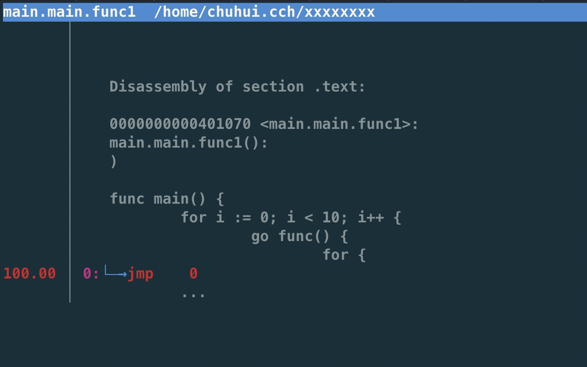

=  Go 语言性能优化

Latency numbers every programmer should know:

https://colin-scott.github.io/personal_website/research/interactive_latency.html

== 优化工作流

建立评估指标(eg. Latency) -> 提出解决方案 -> 尝试方案

不断重复

== 问题定位工具

=== pprof

基本原理：

[quote]
____
The builtin Go CPU profiler uses the setitimer(2) system call to ask the operating system to be sent a SIGPROF signal 100 times a second. Each signal stops the Go process and gets delivered to a random thread's sigtrampgo() function. This function then proceeds to call sigprof() or sigprofNonGo() to record the thread's current stack.

Since Go uses non-blocking I/O, Goroutines that wait on I/O are parked and not running on any threads. Therefore they end up being largely invisible to Go's builtin CPU profiler.
____

每秒被唤醒 100 次，记录每个线程上的栈，那些等待 IO 被 gopark 之类挂起的 goroutine 不会被采集到，因为不在线程上运行，gopark 挂起 goroutine 后，当前线程一般会进 schedule -> findrunnable 的调度循环。

=== fgprof

[quote]
____
fgprof is implemented as a background goroutine that wakes up 99 times per second and calls runtime.GoroutineProfile. This returns a list of all goroutines regardless of their current On/Off CPU scheduling status and their call stacks.
____

比较类似，但是会包含那些 Off CPU 的 goroutine。

可以用来诊断 CPU、IO 混合的执行时间占比。

这个成本还是比普通的 pprof 高一些的。

=== trace

一般用来诊断一些诡异的抖动问题，或 runtime 的 bug(或者用来学习 runtime 的执行流)，用来做问题诊断效果一般。

基本原理是在 runtime 中埋了大量点，记录一堆 event 来追踪 runtime 执行流程。

如果对一些调度问题有疑问，可以在 trace 里做观察，不过拿来定位问题还是比较费劲的。

https://xargin.com/a-rlock-story/

=== perf

perf 也是可以用的，比如线上没开 pprof 的时候，发现 CPU 炸了，perf 可以看看到底在干啥，因为 Go 默认会把 DWARF 调试信息带进二进制文件中，通过 perf 的 zoom 功能也可以一直看到哪行代码(或者是汇编)占用了比较高的 CPU。

[source, text]
----
$ perf stat -e task-clock,cycles,instructions,cache-references,cache-misses ./hello
yyyy

 Performance counter stats for './hello':

          1.464376      task-clock (msec)         #    0.979 CPUs utilized
         3,681,288      cycles                    #    2.514 GHz
         1,722,170      instructions              #    0.47  insn per cycle
            46,475      cache-references          #   31.737 M/sec
            21,479      cache-misses              #   46.216 % of all cache refs

       0.001495925 seconds time elapsed
----

perf top



== 局部优化

[WARNING]
====
调用外部命令
====

[source,go]
----
package main

import (
	"os/exec"
	"testing"

	uuid "github.com/satori/go.uuid"
)

var uu []byte
var u1 uuid.UUID

func BenchmarkUUIDExec(b *testing.B) {
	for i := 0; i < b.N; i++ {
		uu, _ = exec.Command("uuidgen").Output()
	}
}

func BenchmarkUUIDLib(b *testing.B) {
	for i := 0; i < b.N; i++ {
		u1 = uuid.NewV4()
	}
}
----

[WARNING]
====
字符串操作
====

用加号连接，和 Sprintf 差别还是比较大的：

[source,go]
----
func BenchmarkBytesBufferAppend(b *testing.B) {
	for i := 0; i < b.N; i++ {
		var msg bytes.Buffer
		msg.WriteString("userid : " + "1")
		msg.WriteString("location : " + "ab")
	}
}

func BenchmarkBytesBufferAppendSprintf(b *testing.B) {
	for i := 0; i < b.N; i++ {
		var msg bytes.Buffer
		msg.WriteString(fmt.Sprintf("userid : %d", 1))
		msg.WriteString(fmt.Sprintf("location : %s", "ab"))
	}
}
----

image::string_bench.png[]

fmt.打印系列大部分会造成变量逃逸(interface 参数)。

== 全局优化

寻找程序的整体瓶颈。

wrk、pprof、压测平台

== 性能瓶颈举例

=== 业务逻辑

* 查数据库本来 in 查询就可以了，但是却 for 循环查。
TODO

=== 序列化 CPU 占用过高

寻找一些针对性进行过优化的库，或者从文本协议更换为二进制协议。

=== 算法时间复杂度

显而易见，O(logn) 和 O(n)，O(logn) 最多就 64 次，而 O(n) 可能耗尽计算资源。

runtime 里的算法优化：

```
                     ┌──────────────────────┐                                       
                     │                      │                                       
                     │                      │                                       
                     │    npagesKey: 130    │                                       
                     │  spanKey: 0x1234567  │                                       
                     │     priority: 1      │                                       
                     │                      │                                       
                     │                      │                                       
                     └──────────────────────┘                                       
                                 │                                                  
            ┌────────────────────┴──────────────────┐                               
            │                                       │                               
            ▼                                       ▼                               
┌──────────────────────┐                ┌──────────────────────┐                    
│                      │                │                      │                    
│                      │                │                      │                    
│    npagesKey: 129    │                │    npagesKey: 132    │                    
│  spanKey: 0x4231560  │                │  spanKey: 0x2234521  │                    
│     priority: 10     │                │     priority: 12     │                    
│                      │                │                      │                    
│                      │                │                      │                    
└──────────────────────┘                └──────────────────────┘                    
                                                    │                               
                                        ┌───────────┴───────────────────┐           
                                        │                               │           
                                        ▼                               ▼           
                            ┌──────────────────────┐        ┌──────────────────────┐
                            │                      │        │                      │
                            │                      │        │                      │
                            │    npagesKey: 132    │        │    npagesKey: 136    │
                            │  spanKey: 0x2234000  │        │  spanKey: 0x2314213  │
                            │     priority: 14     │        │    priority: 131     │
                            │                      │        │                      │
                            │                      │        │                      │
                            └──────────────────────┘        └──────────────────────┘
```

=== 过多的系统调用

合并调用，writev？

=== 过多的对象

==== sync.Pool

sync.Pool 才能实现 zero garbage。benchmark 中的 0 alloc，其实是因为对象有复用，alloc 平均 < 1。

struct 可以复用，slice 可以复用，但 map 不太好复用。

复用本身可能导致 bug，例如：

* 拿出时不 Reset
* slice 缩容时，被缩掉对象如果不置 nil，是不会释放的
* 在 Put 回 Pool 时，不判断大小，导致了进程占内存越来越大

==== offheap

如果数据不可变，只作查询，也可以考虑 offheap，但局限性较大。

下面三个库可以看看。

https://github.com/glycerine/offheap

https://github.com/coocood/freecache

https://github.com/allegro/bigcache

==== 减少变量逃逸

使用 go build -gcflags="-m -m" 来分析逃逸。

如果要分析某个 package 内的逃逸情况，可以打全 package 名，例如 go build -gcflags="-m -m" github.com/cch123/elasticsql

=== 过多的调度 CPU 占用(例如火焰图中，schedule 有一大条)

类似 fasthttp 的 workerpool。

https://github.com/valyala/fasthttp/blob/master/workerpool.go#L19

创建好的 goroutine 可以反复使用，并且自己实现可以控制最大的并发 worker 数。

=== 锁冲突

通过阶梯加压，观察 goroutine 的变化趋势。当触发锁瓶颈时，会出现大量等锁的 goroutine。

==== 原因

临界区太大，其中包含系统调用。

有些锁是避免不了的，例如 fs.Write，一定有锁，且该锁在 runtime 内部。

性能敏感场合，全局锁，比如 rand 的全局锁。单机 10w+ QPS 即可能触发该瓶颈(和环境以及程序行为有关)

有些开源库设计是一个 struct 对应一个 sync.Pool，这种时候，如果你不对该 struct 进行复用，就会触发 runtime 中的锁冲突：

参考本文中的第一个案例：

https://xargin.com/lock-contention-in-go/

==== 解决方案

* map -> sync.Map
* 换用无锁结构，如 lock free queue、stack 等
* 分段锁
* copy on write，业务逻辑允许的前提下，在修改时拷贝一份，再修改

=== 程序局部性

==== false sharing

时间局部性、空间局部性

[source, go]
----
var semtable [semTabSize]struct {
	root semaRoot
	pad  [cpu.CacheLinePadSize - unsafe.Sizeof(semaRoot{})]byte
}
----

[source, go]
----
var timers [timersLen]struct {
	timersBucket

	// The padding should eliminate false sharing
	// between timersBucket values.
	pad [cpu.CacheLinePadSize - unsafe.Sizeof(timersBucket{})%cpu.CacheLinePadSize]byte
}
----

类似下面的二维数组，怎么遍历更快？

[source, go]
----
var a = [10000][10000]int{}
----

在标准库中，考虑到局部性而实现的 sort 的例子：

[source, go]
----
func quickSort_func(data lessSwap, a, b, maxDepth int) {
	for b-a > 12 {
		if maxDepth == 0 {
			heapSort_func(data, a, b)
			return
		}
		maxDepth--
		mlo, mhi := doPivot_func(data, a, b)
		if mlo-a < b-mhi {
			quickSort_func(data, a, mlo, maxDepth)
			a = mhi
		} else {
			quickSort_func(data, mhi, b, maxDepth)
			b = mlo
		}
	}
	if b-a > 1 {
		for i := a + 6; i < b; i++ {
			if data.Less(i, i-6) {
				data.Swap(i, i-6)
			}
		}
		insertionSort_func(data, a, b)
	}
}
----

==== true sharing

这时候一般都有锁，所以本质上还是怎么降低锁的粒度。

[quote]
____
sync: RWMutex scales poorly with CPU count
____

=== timer 性能问题

* 老版本的 timer 会有高压力下触发不准时问题，且触发大量的 syscall -> https://github.com/golang/go/issues/25471
[source, text]
----
// xiaorui.cc

go1.13

% time     seconds  usecs/call     calls    errors syscall
------ ----------- ----------- --------- --------- ----------------
 84.00   12.007993         459     26148      3874 futex
 11.43    1.634512         146     11180           nanosleep
  4.45    0.635987          32     20185           sched_yield

go1.14

% time     seconds  usecs/call     calls    errors syscall
------ ----------- ----------- --------- --------- ----------------
 58.78    4.837332         174     27770      4662 futex
 19.50    1.605189         440      3646           nanosleep
 11.55    0.950730          44     21569           epoll_pwait
  9.75    0.802715          36     22181           sched_yield:w

----

优化后，CPU 占用降低，到时不触发的问题也有所改善。

* 用时间轮实现粗粒度的时间库

可以搜搜大量的 timewheel 库。

ticker 使用时要尤其注意泄露问题，否则程序 CPU 使用会逐渐上涨。

=== 汇编优化

SIMD 优化，如 math 库。gonum 中也有一些例子。
无法跨平台，如未来碰到国产化需求要上 ARM、龙芯(MIPS) 就尴尬了。

https://github.com/gonum/gonum/tree/master/internal/asm/f64

== 语言本身的一些缺陷

=== 越压越差

=== 调度和锁

调度 + 锁出问题，难复现，难定位

=== 不注意造成死循环会让整个进程 hang 住

GC 需要抢占所有 goroutine，老版本的抢占需要用户协程在 morestack 时主动退出。

卡 gcwaiting。

=== 物理机负载高时，延迟非线性增长

压力高会导致响应慢，响应慢会导致并发执行的 goroutine 数变多，响应结束后的垃圾变多，同时会导致更高的调度成本和 GC 扫描成本，级联恶化。

=== 调度导致 CPU 密集型业务超时

TODO，bcrypt 的例子

因为调度导致的全部超时

=== 老版本的问题

==== sync.Pool 在 GC 时全清空

导致在每一轮 GC 后都有延迟抖动，升级 1.13 后长尾请求有改善。

sync.Pool 的设计思路：尽量从本地拿到 cache 对象，拿不到通过无锁 shared 队列去找，还是找不到，全局 lock 找或者生成新的。

这种思路比较类似 L1 -> L2 -> L3 的多级缓存设计，runtime 的内存分配演进也是类似的思路。

=== 当前问题定位工具的局限性

难以定位抖动问题。

无论 pprof、perf、fgprof、trace 都是人肉触发，抖动时人又不在系统旁边。

这种情况需要 self-aware 的 profile dump 方式来解决问题。

或者向 Google 看齐:

==== continuous profiling

在生产环境对更细粒度的程序性能做实时监控，方便及时发现、定位、分析问题。

早发现，早治疗，晚发现，成本高。

https://storage.googleapis.com/pub-tools-public-publication-data/pdf/36575.pdf

image::con_perf.png[]
