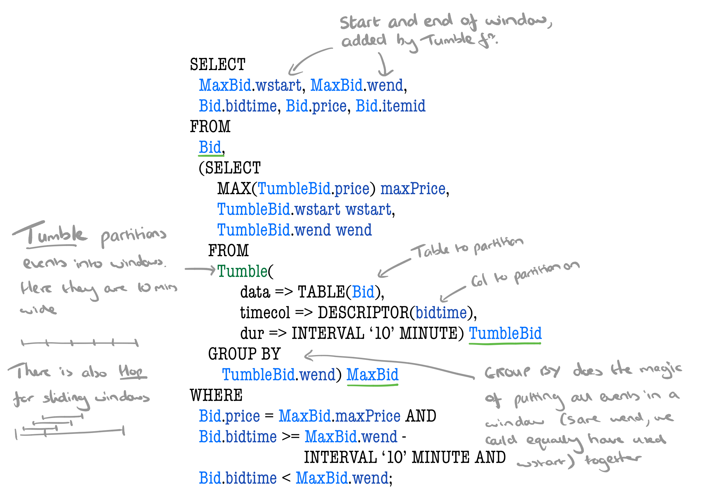
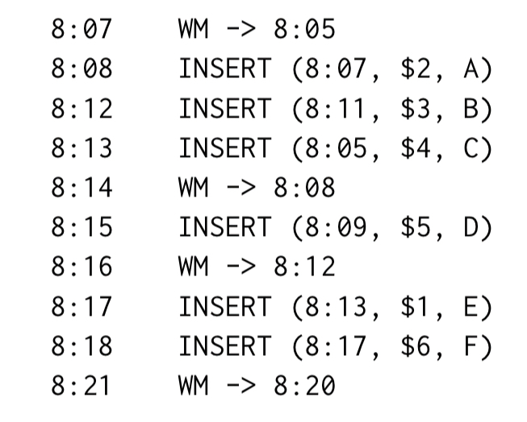
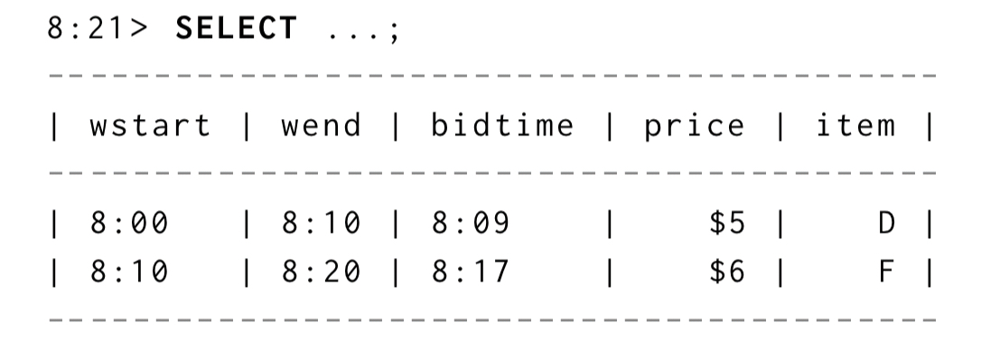
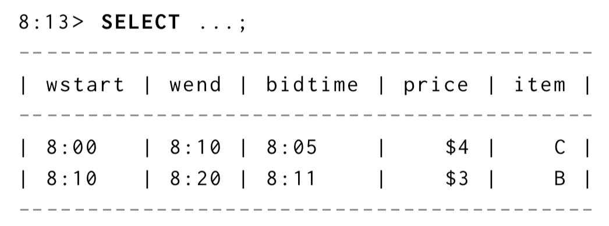
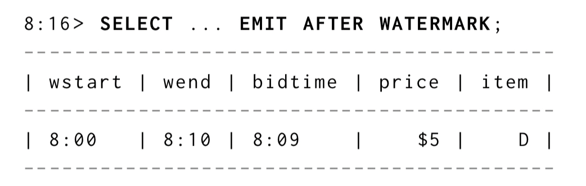
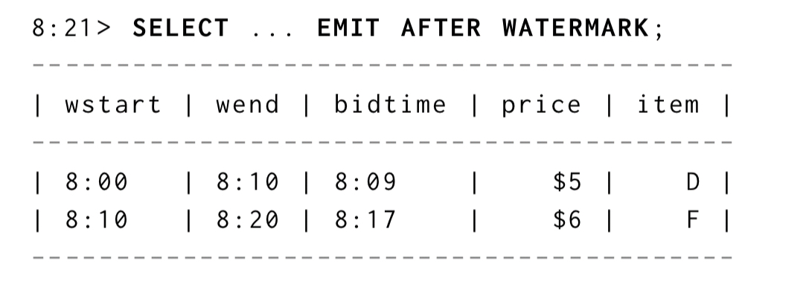
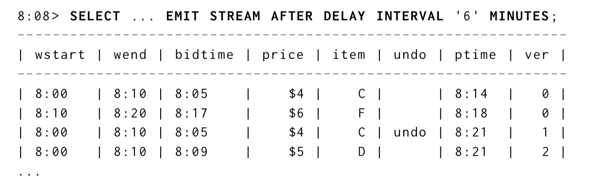
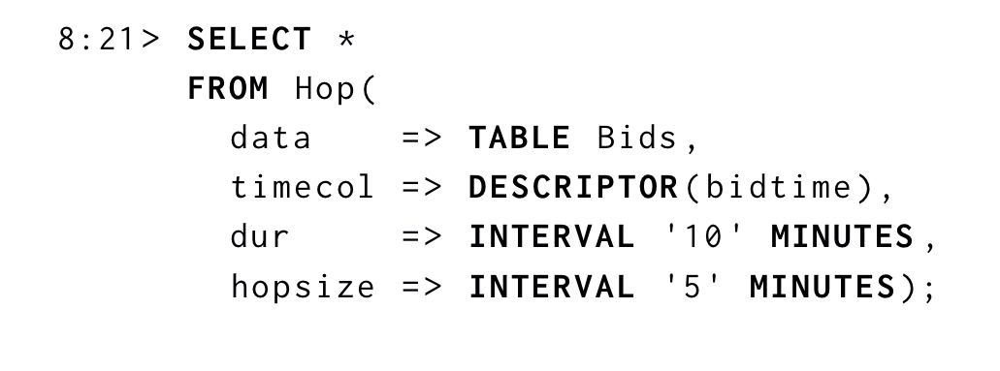
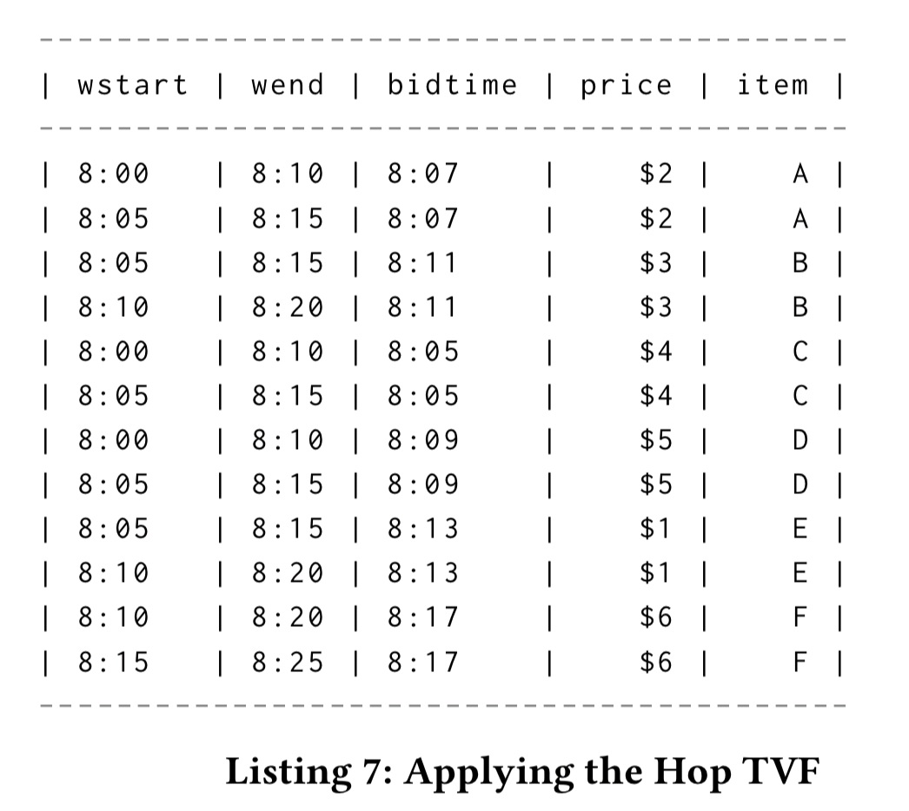
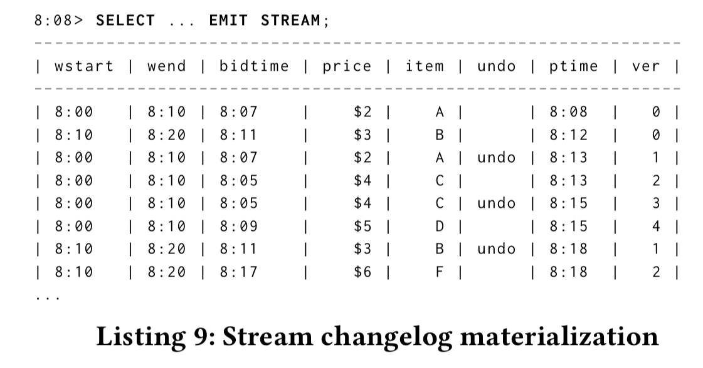

= One SQL to Rule Them All

== 背景

数据处理领域，所有技术路径最终都导向了 SQL。这篇论文是由 Apache Beam、Apache Calcite 和 Apache Flink 等项目的专家共同发表的。论述了他们构建流式处理中 SQL 接口的经验。最终结果是对 SQL 标准的一部分扩展，国际 SQL 标准组织也正在为这部分扩展功能而工作。

____
The thesis of this paper, supported by experience developing large open-source frameworks supporting real-world streaming use cases, is that the SQL language and relational model as-is and with minor non-intrusive extensions, can be very effective for manipulation of streaming data.
____

这里的大部分观点已经在 Apache Beam， Calcite 和 Flink 中以某种形式进行了支持。streaming SQL 接口目前已经被 Alibaba，Huawei，Lyft，Uber 和其它一些公司所接受，并对本文的作者提供了下列反馈，以阐述他们为什么做出这样的决定： 

* 开发和接受的成本比非声明式的流式处理 API 要小得多
* 大家对标准 SQL 都比较熟悉，也就更容易接受，对其它的非标准的查询语言则没有那么熟悉
* 因为有 eent time 语义的关系，常见的流式处理任务如窗口聚合、join 能很容易地表达。
* 如果发生程序逻辑错误或服务不可用，已被持久化的数据流还能以同样的查询重新处理。那些活跃的新数据也不例外。

== Foundational principles

大目标是在相同的一个框架下统一流和表：

____
Combined, tables and streams cover the critical spectrum of business operations ranging from strategic decision making supported by historical data to near- and real-time data used in interactive analysis… We believe, based on our experience and nearly two decades of research on streaming SQL extensions, that using the same SQL semantics in a consistent manner is a productive and elegant way to unify these two modalities of data…
____

作者也指出，之前的很多年，该领域已经做了很多工作，这篇论文中的结论也从之前的工作中借鉴了很多。这些经验来自于 Flink、Beam 和 Calcite。

相比传统的关系型视图，流增加了了时间的概念。在流的消费端所观测到的是一个可变的数据库表，该表和时间相关，随时间变化，称为 time-varying relation（TVR）。也就是说，对于一个查询来说，其结果总是表示某一个具体时间“点”的结果。

____
A time-varying relation is exactly what the name implies: a relationship whose contents may vary over time… The key insight, stated but under-utilized in prior work, is that streams and tables are two representations for one semantic object.
____

TVR，从定义上来讲，就在时间相关的关系数据上，支持了完整的关系操作符。所以提案的第一部分啥都不需要。我们需要的是 TVR，而这种 TVR 实际上已经存在了，我们只要使用 - 并且让 SQL 在 TVR 上的操作更显式就好。

不过还需要一些扩展，来支持 event time 的概念。尤其是需要注意将 event time 和 processing time 区分开。还需要明白事件并不一定要按照 event-time 顺序来被处理。

我们提议使用显式的 event 时间戳和 watermark 这两个概念来支持 event time 的语义。这样可以使我们以正确的 event time 来进行计算，并且能够不消耗无限的资源。

The watermarking model used traces its lineage back to Millwheel, Google Cloud Dataflow, and from there to Beam and Flink. For each moment in processing time, the watermark specifies the event timestamp up to which the input is believed to be complete at that point in processing time.

The third piece of the puzzle is to provide some control over how relations are rendered and when rows are materialized. For example: should a query’s output change instantaneously to reflect any new input (normally overkill), or do we just want to see batched updates at the end of a window?

== Example

Query 7 from the NEXmark stream querying benchmark monitors the highest price items in an auction. Every ten minutes, it returns the highest bid and associated itemid for the most recent ten minutes.

Here’s what it looks like expressed using the proposed SQL extensions. Rather than give a lengthy prose description of what’s going on, I’ve chosen just to annotate the query itself. Hopefully that’s enough for you to get the gist…

输入以下一些事件：

那么在 8:21 执行的 query 则会产生下面这样的 TVR：

Whereas an evaluation at 8:13 would have looked different:

Note that as currently expressed, the query returns point in time results, but we can use the materialisation delay extensions to change that if we want to. For example, SELECT ... EMIT AFTER WATERMARK; will only emit rows once the watermark has passed the end of the a window.

So at 8:16 we’d see

And at 8:21:

If we want to see rows for windows regardless of watermark, but only get periodic aggregated snapshots we can use SELECT ... EMIT STREAM AFTER DELAY (STREAM here indicates we want streamed results too).

== SQL Extensions

本论文的提议包含对标准 SQL 的 7 项扩展：

1. Watermarked event time column: an event time column in a relation is a distinguished column of type TIMESTAMP with an associated watermark. The watermark is maintained by the system.
2. Grouping on event timestamps: when a GROUP BY clause groups on an event time column, only groups with a key less than the watermark for the column are included
3. Event-time windowing functions: starting with Tumble and Hop which take a relation and event time column descriptor and return a relation with additional event-time columns as output. Tumble produces equally spaced disjoint windows, Hop produces equally sized sliding windows.
4. Stream materialization: EMIT STREAM results in a time-varying relation representing changes to the classic result of the query. Additional columns indicate whether or not the row is a retraction of the previous row, the changelog processing time offset of the row, and a sequence number relative to other changes to the same event time grouping.
5. Materialization delay: when a query has an EMIT AFTER WATERMARK modifier, only complete rows from the results are materialized
6. Periodic materialization: when a query has EMIT AFTER DELAY d rows are materialized with period d, instead of continuously.
7. Combined materialization delay: when a query has EMIT AFTER DELAY d AND AFTER WATERMARK rows are materialized with period d as well as when complete.

== Hop example

== Emit Stream example

== Lessons learned along the way

Section 5 in the paper contains a list of lessons learned from Apache Calcite, Flink, and Beam that have informed the design. I don’t have the space to cover them all here, but as a flavour here are a couple that caught my eye:

* Because event timestamps are just regular attributes and can be referenced in ordinary expressions, it’s possible that an expression result may not remain aligned with watermarks, which needs to be taken into account during query planning.
* Users find it hard to reason about the optimal use of event time in queries, which can lead to expensive execution plans with undesirable semantics.

== Future work

For me, the impressive thing about this work is how much can be achieved with so little. A read through the future work section though (§8) soon shows that the set of extensions is going to need to grow some more before this is done.

As an example, one area that caught my eye was the SQL standard definition that time in SQL queries is fixed at query time (either to the current time, or to a specified fixed time using AS OF SYSTEM TIME). That means you can’t yet express a view over the tail of a stream (you can use an expression such as CURRENT_TIME - INTERVAL ‘1’ HOUR in a predicate, but CURRENT_TIME takes on one fixed value at the time the query is executed). Likewise enriching a TVR with attributes from a temporal table at a specific point in time (e.g. event time) needs additional support.

